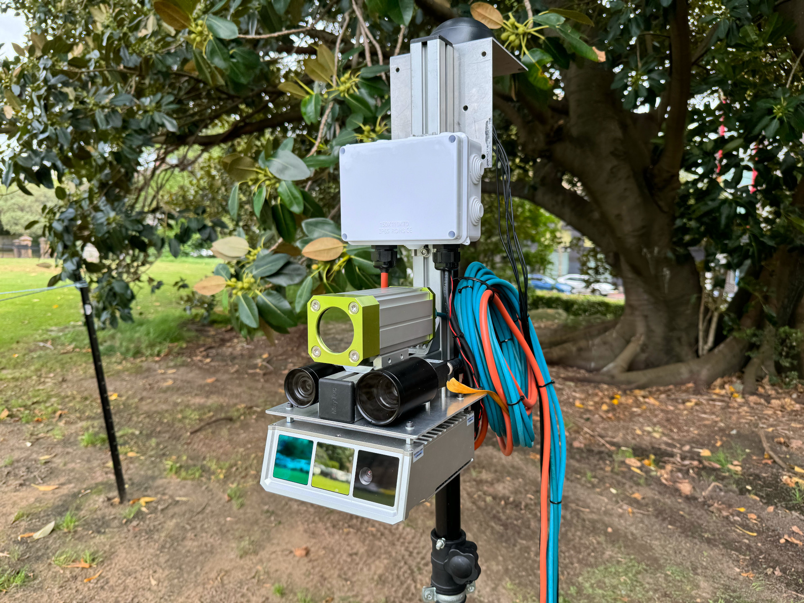
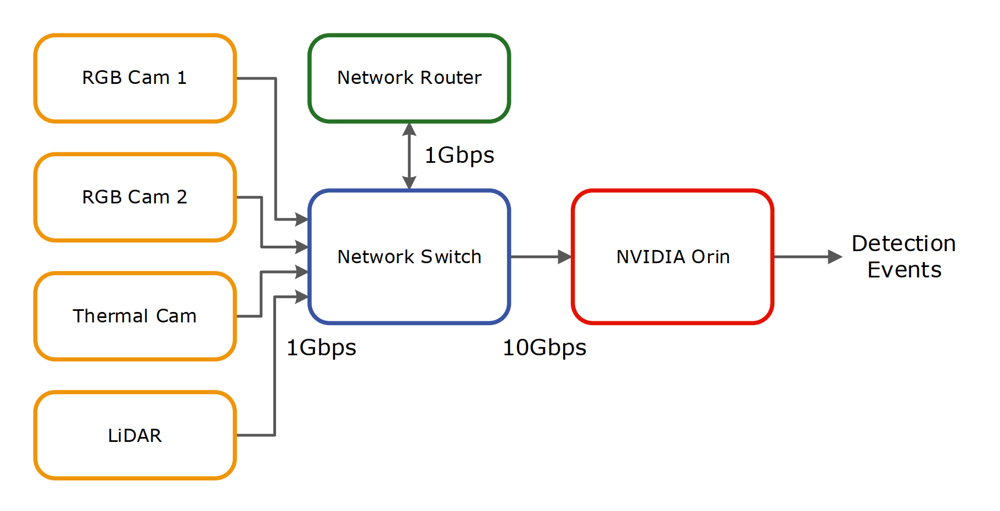
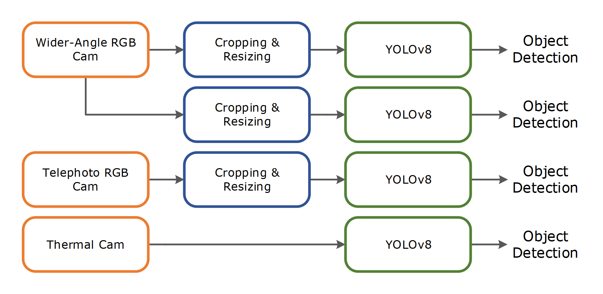
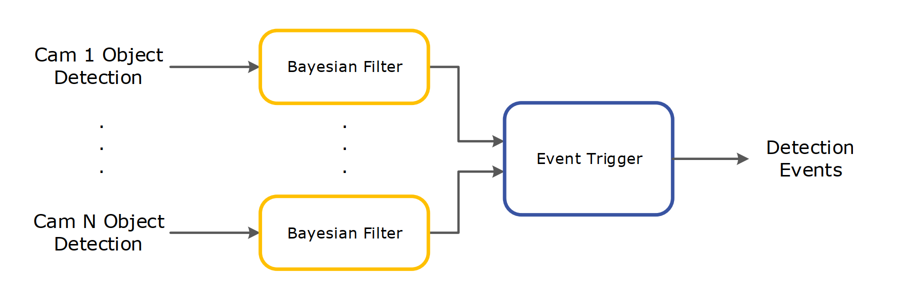

# Introduction

This repository contains code for the following Queensland Department of Transport and Main Roads (TMR) project:

**Development and Performance Testing of a LAARMA---Large Animal Activated Roadside Monitoring and Alert System**

The project report can be accessed for free soon.

Contact: [msha3421](https://github.com/msha3421), [Hommus](https://github.com/Hommus)

## Tested system hardware

<div align="center">
    
</div>

### Sensors:
* Wider-Angle RGB Cam
    - Body: Lucid Vision TDR054S-CC
    - Lens: Edmund Optics 12 mm FoV 41.4 deg @ 2/3" sensor format
    - IP67 Lens Tube: Lucid Vision IPTC-D355L299
* Telephoto RGB Cam
    - Body: Lucid Vision TDR054S-CC
    - Lens: Edmund Optics 50 mm FoV 10 deg @ 2/3" sensor format
    - IP67 Lens Tube: Lucid Vision IPTC-D440L685
* Thermal Cam
    - Body + Lens: FLIR A68, Model: 11302-0101, FoV 24 deg
    - IP67 Enclosure: autoVimation Salamander S with Germanium window
* LiDAR
    - Body: Neuvition Titan M1-R

### Edge Computer:
* Main Unit: NVIDIA Orin 64GB Dev Kit
* Accessory: Samsung 980 Pro 2TB SSD

### Network:
* Router: Teltonika RUTX11
* Switch: QNAP QSW-2104-2T

**Note:** Users need to provide a data SIM card for 4G connection if remote access is required.

<div align="center">
    
</div>

## Tested software environment
* JetPack version: 5.1.2 (L4T 35.4.1)

# Install

## Build docker image locally
After git clone this repositry to the Orin.

```bash
cd rads_docker
./build.sh
```

## Auto Install

Before install, make sure the SSD is mounted under `/mnt/ssd` for data logging.
```bash
autoinstall/install.sh
```
The script will automatically set up the software environment within the Orin and the systemd service `sensors`.

**Note:** Users need to set up Amazon Web Services (AWS) S3 or equivalent cloud storage for storing logged data.

# Software Components
The service runs a few software components:
* Multiple image processing pipelines. Each pipeline captures images from a camera as input and performs basic image manipulation techniques, including cropping and resizing, before feeding them into the
YOLOv8 object detector to generate animal detection results.
<div align="center">
    
</div>

* Event triggering pipeline, which takes the YOLOv8 detection results as input, performs signal
filtering, and aggregates the outcomes to trigger the final detection events. The raw detection
results are often noisy, containing missed detections and false positives, which necessitate
proper signal filtering. In this pipeline, independent Bayesian filters are employed for each
object detection input channel. Eventually, the filtered signals are fused to trigger a detection
event, which is then connected to the event-triggered data logging and the roadside variable message
display.
<div align="center">
    
</div>

* Continuous data logging (mp4 and mcap files) and event-triggered data logging (mcap files). The data logging folders are under `/mnt/ssd/logging`.

* RTSP stream of the camera images for quick live previews through `rtsp://<orin_ip_address>:1000/cameras`.

Details can be found in the project report.

**Note:** If users want to use other camera models, they need to prepare their ROS2 drivers and update the corresponding ROS2 launch files under `autoinstall/custom/launch/camera_*_pipe.launch.py` to let the drivers interface with the downstream components in the image processing pipeline.

# Tools

## Deploy New YOLOv8 Models

When new YOLOv8 models (pt files) have been trained up using the self-training machine learning pipeline [Link to repo], they need to be converted to TensorRT engines for field deployment.

**Example:** To deploy a new model yolov8m_cass_new.pt

* Step 1: On Ubuntu PC:
```bash
pip install ultralytics
yolo export model=yolov8m_cass_new.pt format=onnx imgsz=480,640
```

* Step 2: On Orin:
```bash
/usr/src/tensorrt/bin/trtexec --onnx=yolov8m_cass_new.onnx --saveEngine=yolov8m_cass_new.engine --fp16
```
Move the converted engine file to `/mnt/ssd/ml/yolov8/` and in the configuration file `autoinstall/custom/config/img_yolo_params.yaml`, update `engine_file_path` to point to the path of the new model: `'/mnt/ssd/ml/yolov8/yolov8m_cass_new.engine'`.

## Logged Data Extraction

The continuous data logging operates as long as the system is running, providing low frame rate sensory data for
* model training, validation, and testing using the proposed self-training pipeline, and
* providing ground truth for system evaluation after human inspection.

The recorded mp4 files are uploaded automatically to AWS on an hourly basis through 4G connection.

The recorded bags are selectively tagged and transferred to AWS, as shown in an example below.

**Example:**

Step 1: Scan bags with detection labels:
* To scan bags within one day:
```bash
cd autoinstall/tools/tagger
./auto_bag_tagger.sh 240618
```
* To scan 10 days:
```bash
./auto_bag_tagger.sh 24061
```
* To scan a whole month:
```bash
./auto_bag_tagger.sh 2406
```
The scanning may take a few hours depending on the date range. The scan results are saved in `/mnt/ssd/logging/tagged_bags_2406.txt`.

Step 2: Push tagged bags to cloud:
```bash
cd autoinstall/tools/sync
cat /mnt/ssd/logging/tagged_bags_2406.txt | ./sync_bags.sh
```
